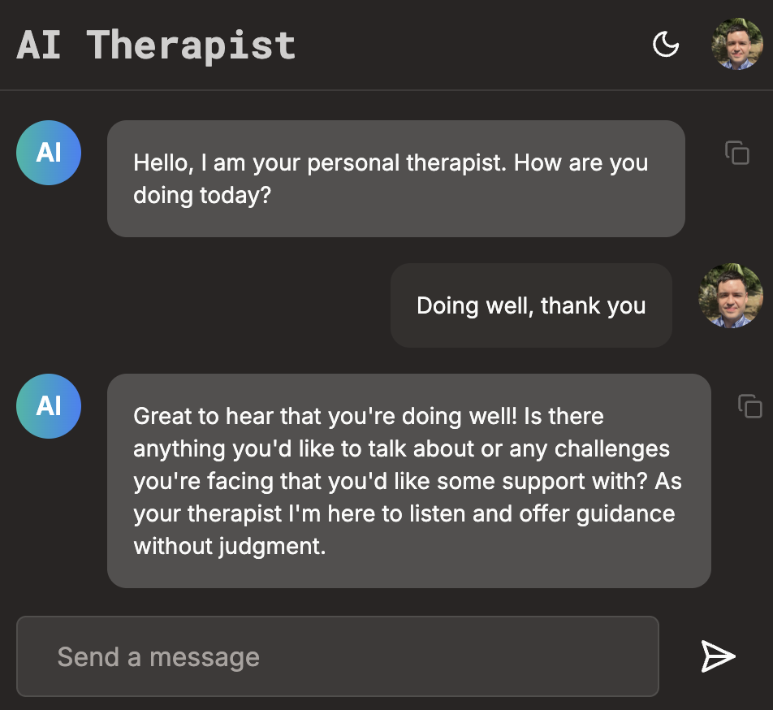

# AI Therapist 🧠

An AI-powered mental wellness application providing empathetic conversations and emotional support through OpenAI's GPT model.



**[View Live Demo](https://ai-thera.vercel.app/)**

---

## Features

- 💬 Real-time AI conversations with context-aware responses
- 🔐 Secure authentication and private conversation history
- ⚡ Redis caching for fast response times
- 📱 Responsive, mobile-first design

## Tech Stack

**Frontend:** Next.js 14, TypeScript, Tailwind CSS, shadcn/ui  
**Backend:** MySQL (Clever Cloud), Redis (Upstash), Prisma ORM  
**Auth:** Clerk  
**AI:** OpenAI GPT API  
**Deployment:** Vercel

## Quick Start

```bash
git clone https://github.com/neilgebhard/ai-therapist.git
cd ai-therapist
npm install
```

Create a `.env` file (use `.env.example` as template) with your API keys:
```env
DATABASE_URL="..."
OPENAI_API_KEY="..."
CLERK_SECRET_KEY="..."
UPSTASH_REDIS_REST_URL="..."
```

Run the app:
```bash
npx prisma migrate dev
npm run dev
```

Open [http://localhost:3000](http://localhost:3000)

## Why I Built This

To explore real-time AI integration, conversation context management, and secure authentication flows while creating a practical mental wellness tool.

## Key Challenges Solved

- Streaming AI responses in real-time with Next.js Server Actions
- Implementing secure, private user conversations with authentication
- Optimizing database queries with Redis caching
